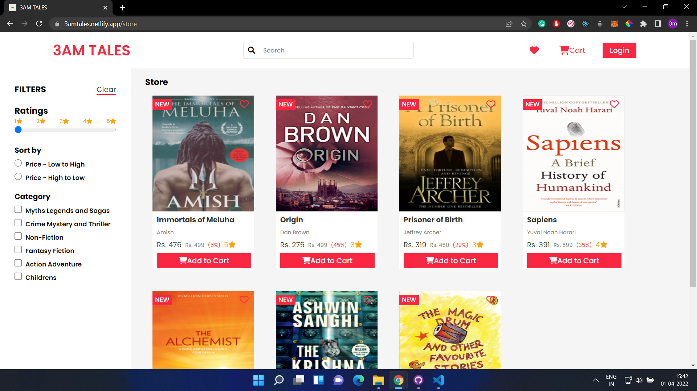

# 3AM TALES

3AM TALES is an online marketplace to buy books whether it is fiction, self-help, biography or non-fiction. It is one stop destination for all things books.

## Live Project Screenshot

## Live Project Link

[3AM TALES](https://3amtales.netlify.app/)

## Tech Stack

**Client:** ReactJS, crimsonUI, CSS

## Features

- Home Page
- Product Listing Page
- Filters by: **price** | **categories** | **ratings**
- Cart Management
- Wishlist Management
- Responsive for all screen sizes

## Feedback

If you have any feedback, please reach out to us at any of the given socials.

## 🔗 Links

